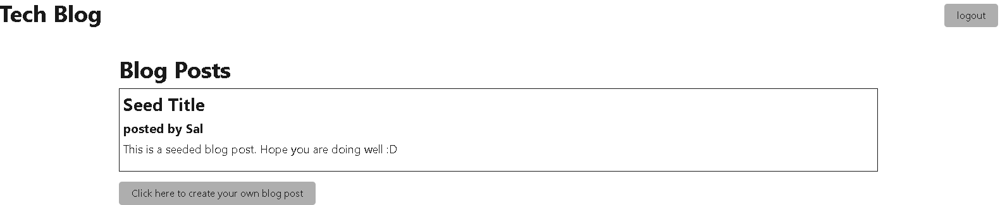

# Tech Blog 
  
  

  ## Description
  An initial drafting of a tech blog website where you can login to view blog posts, and add your own. Future development of this website includes adding a functioning signup page, editing your blog posts, commenting on other, deleting your blog posts, and polishing the front end style and user experience. 

  

  ## Table of Contents
  1. [Usage](#usage)
  2. [Contributing](#contributing)
  3. [Questions](#questions)
  4. [License](#license)

  ## Usage
  See the github repository user seeds for logging in as a fake user. Signup page is in development. Once signed in, you will be able to see blog posts as well as add your own. 

  ## Contributing
  Please contact me on github or email if you are interested in contributing!

  ## Tests 
  none

  ## Quesitons 
  If You have any questions, please feel free to contact me on GitHub:
  Name: slawless08
  Link: undefined

  Or you can email me at samuel.l.lawless@gmail.com

## License 

See the license badge at the top of the page and click the image link to learn more about the license